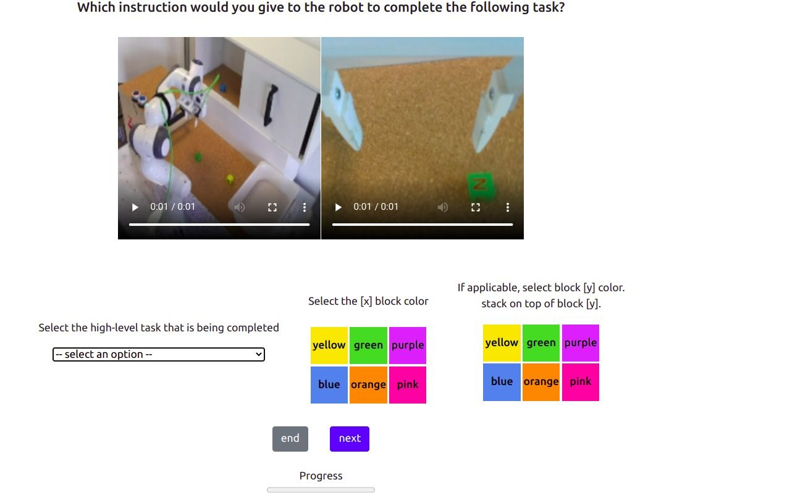

# Language Annotation Web App
[](https://github.com/psf/black)
[](https://opensource.org/licenses/MIT)

This is a simple web annotation tool for annotating undirected, human teleoperated play data with crowdsourced language annotations. 



## Installation
In the source directory type:

```
    conda create -n lang_ann python=3.8
    conda activate lang_ann
    pip install -e .
```

## Computing the language embeddings

Run:
```
python scripts/get_annotations.py
```

The configuration file is in [./scripts/config/retrieve_data.yaml](./scripts/config/retrieve_data.yaml)

This script will automatically take the [database.db](./webapp/database.db) file stored under the webapp/ folder and replace the color names in the language instructions. If the database for which you want to compute the embeddings is in some other directory, you need to modify the [get_annotations.py](./scripts/get_annotations.py) file

By default the script ignores the database entries that are empty (no task) or invalid (missing a color when needed etc). To generate all the annotations you can set the flag "ignore_empty_tasks=False"


Then it will compute the language embeddings using the sentences defined in [webapp/helpers/tasks.yaml](./webapp/helpers/tasks.yaml). Specifically it will sample a random sentence for the corresponding task and compute the embeddings. By default there is only one sentence available for each task.

This file will generate the annotations with the filename "auto_lang_ann.npy" under [./annotations/lang_LANG_ENCODER_NAME](./annotations/). By default this will be  [./annotations/lang_paraphrase-MiniLM-L3-v2](./annotations/lang_paraphrase-MiniLM-L3-v2)

To change the language encoder to compute the embeddings use the flag "lang_model.nlp_model=model_name"

## Visualizing the annotations 
[viz_annotations.py](./scripts/viz_annotations.py)
Please modify the database directory and the desired indices to visualize in the file.
```
python viz_annotations.py
```

## Citations

If you find the code useful, please consider citing:

**HULC++**
```bibtex
@inproceedings{mees23hulc2,
title={Grounding  Language  with  Visual  Affordances  over  Unstructured  Data},
author={Oier Mees and Jessica Borja-Diaz and Wolfram Burgard},
booktitle = {Proceedings of the IEEE International Conference on Robotics and Automation (ICRA)},
year={2023},
address = {London, UK}
}
```

## License

MIT License

## Authorship
This code was developed by [Jessica Borja](https://github.com/JessicaBorja), [Mikel Martinez](https://github.com/mikelmrtinez) and [Oier Mees](www.oiermees.com) at the University of Freiburg, Germany.
